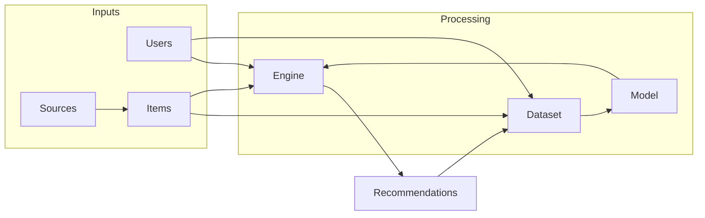

## Recommender systems

Recommender systems are information filtering systems that suggest relevant items to users. In the context of the Villanova project, we are developing a recommender system, dubbed **Themis**, that combines a traditional two-tower recommender with generative artificial intelligence. Language models will be used to enhance the two-tower architecture beyond vector similarity search, and to provide explainable recommendations in natural language.

## Use cases

Applications of the Themis recommender system include recommendations of:

- products from e-commerce websites;
- used products from eBay;
- news articles from online newspapers;
- companies sourced from official directories for business opportunities;
- Wikipedia pages for reading or editing;
- chess openings personalized to a player’s style, inferred from their past games in PGN format.

## Design

